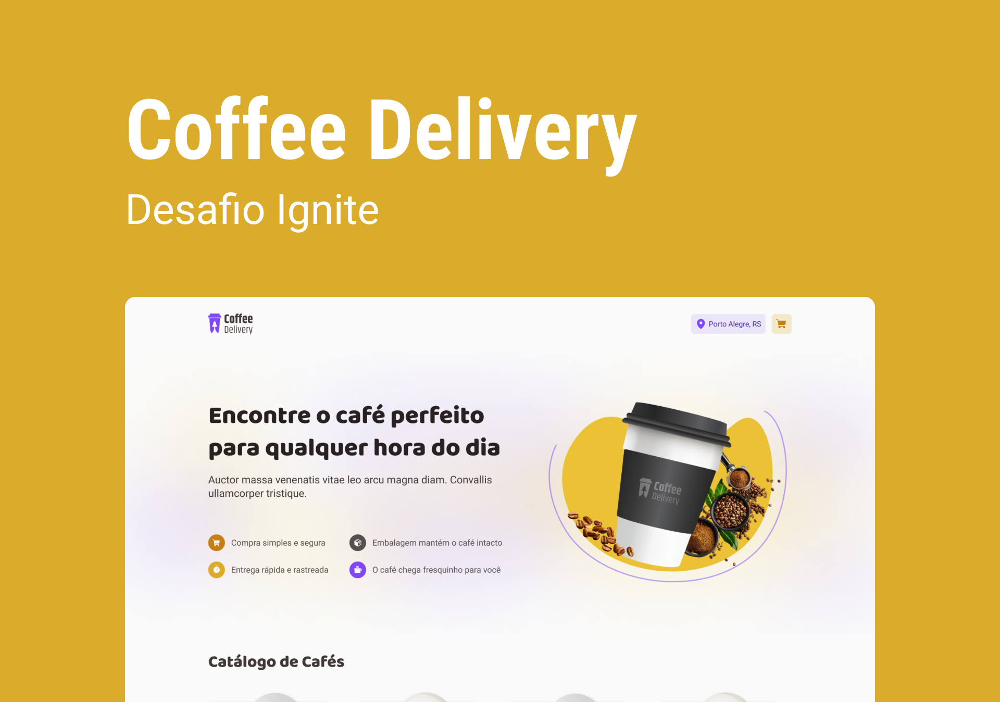

# Coffe-delivery

   

## Why this project?

  This project aims to improve my skills on the various tools that I am learning in my internship so far.

## Ferramentas 🛠

- [React](https://beta.reactjs.org/learn/thinking-in-react)
- [React Testing Library](https://testing-library.com/docs/react-testing-library/intro/)
- [StitchesJS](https://stitches.dev/)
- [Storybook](https://storybook.js.org/)
- [Typescript](https://www.typescriptlang.org/docs/)
- [Plop](https://www.npmjs.com/package/plop)